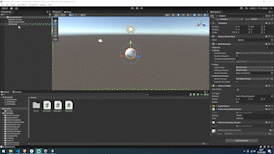

# Unity Voice Demo (Simple Start)

Here you can find a boilerplate Unity project for use with the [Carter API](https://www.carterapi.com).

Stuck? Join the awesome [Discord Community](https://carterapi.com).

<h2>Get Started</h2>

- Install Unity

- Download this project.

- Open this project within Unity.

- Enter your Carter Agent's API KEY and an arbitrary UUID.

- Run the interactive demo, hold SPACE to speak and release when finished.

<h3>Our voice service is in Beta release, accuracy may vary.</h3>

